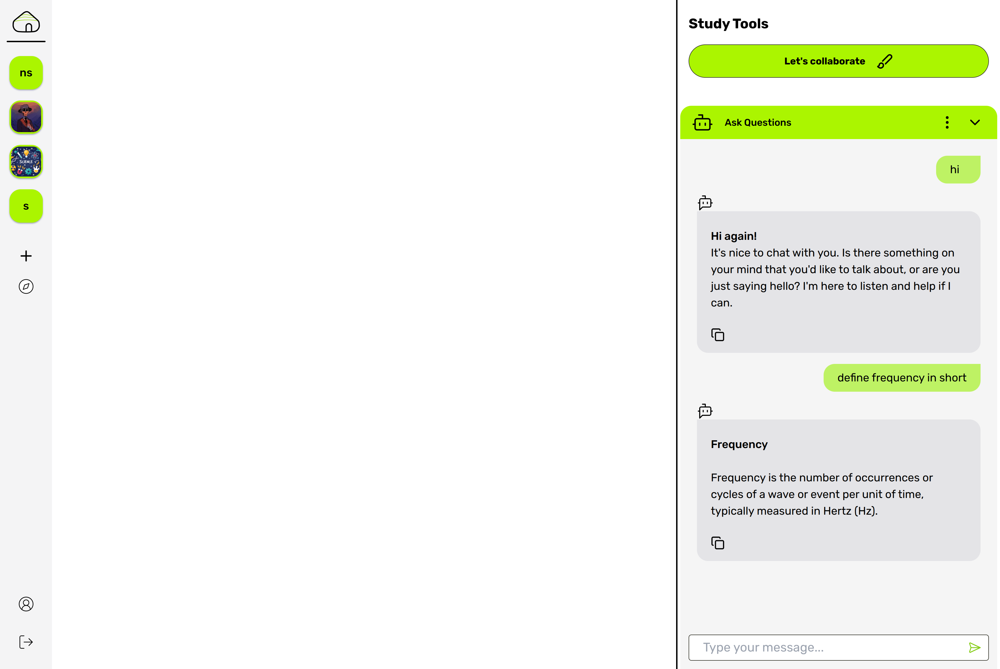
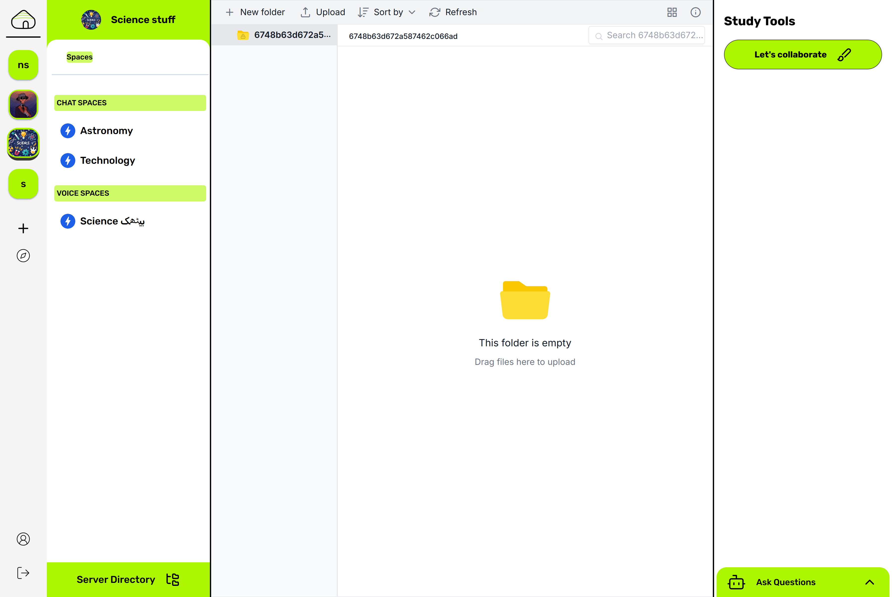
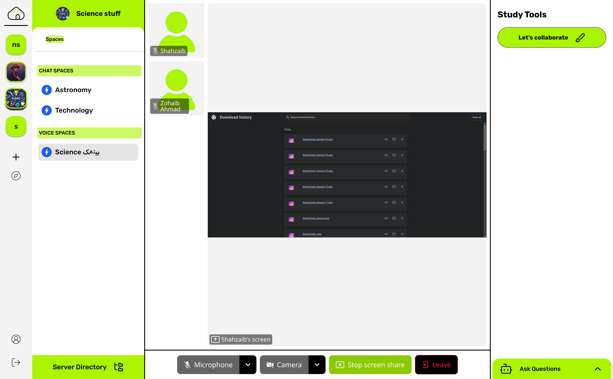
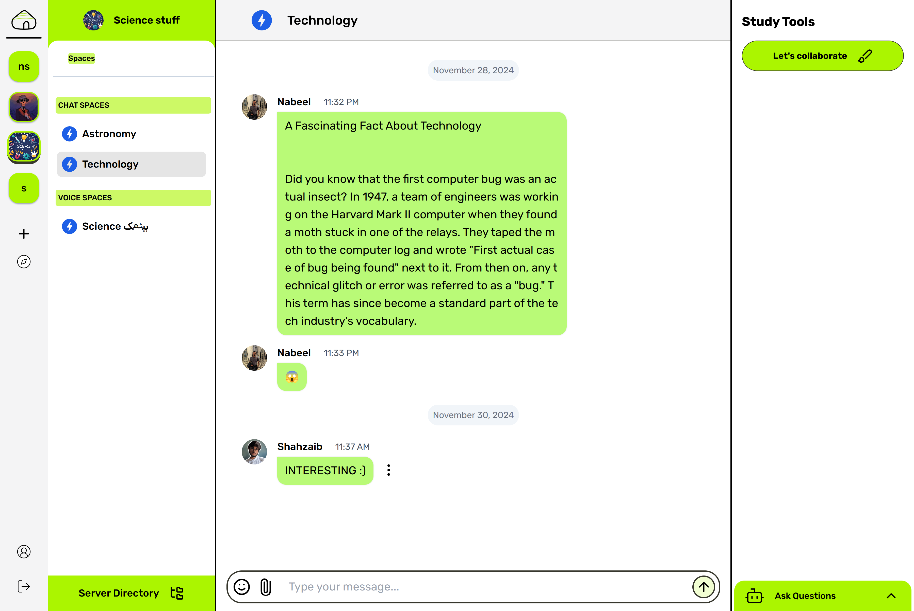
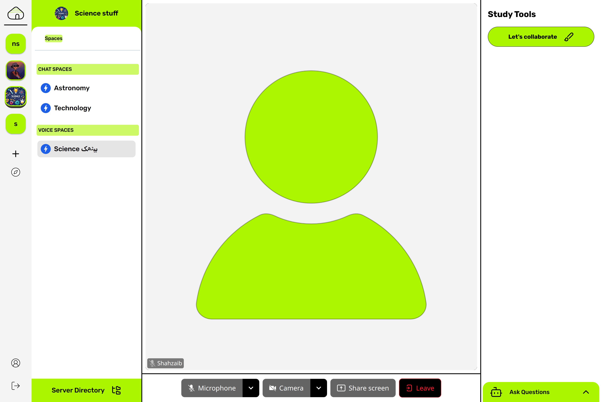
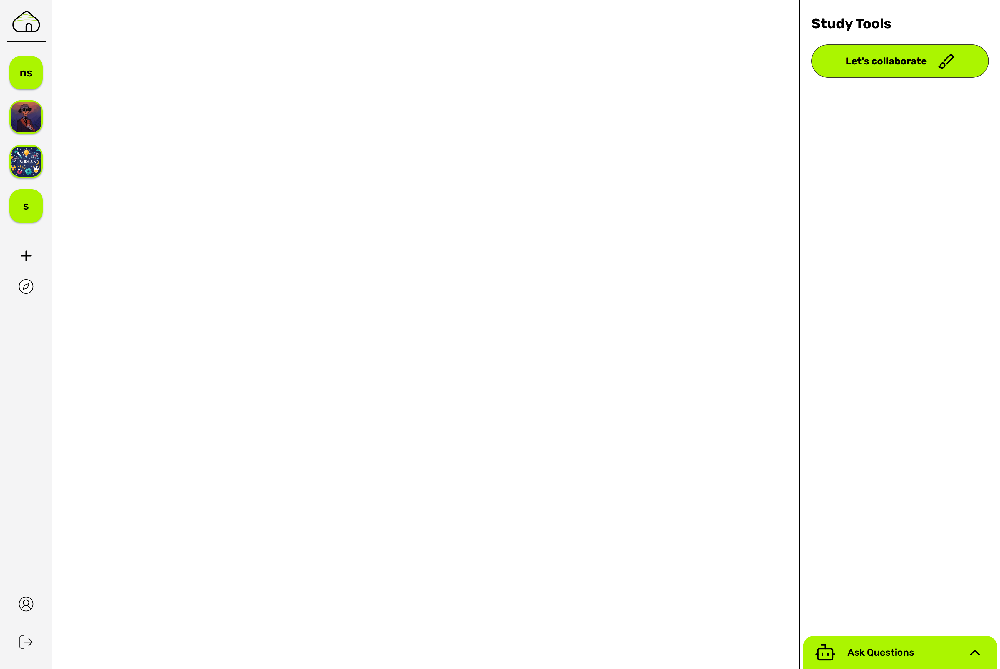
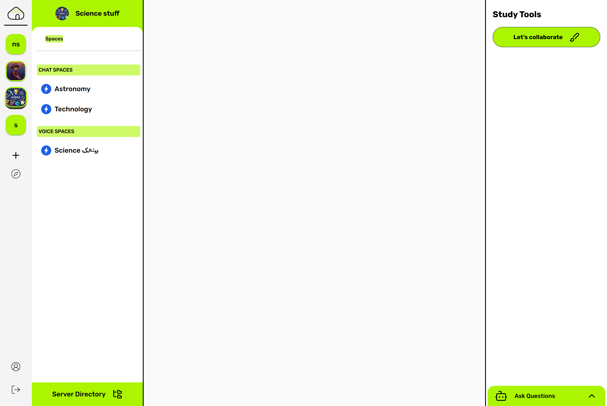
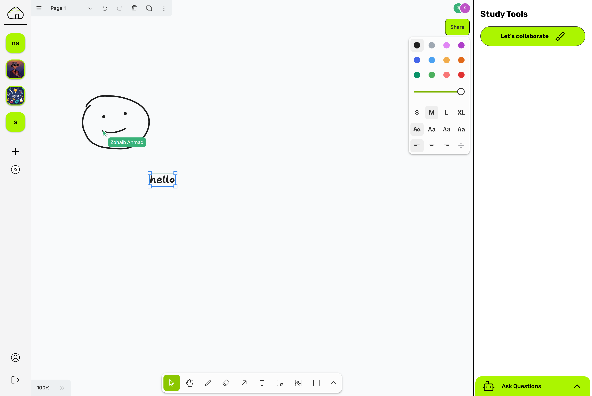
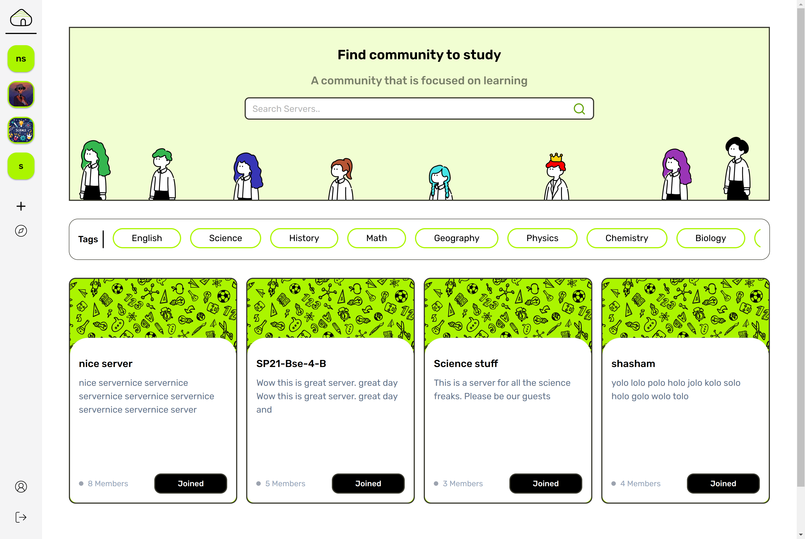

# Yurt - A Collaborative Platform for Students

Yurt is a centralized collaborative learning platform designed to address the unique challenges and demands of modern students, providing an all-in-one solution to streamline academic tasks and enhance productivity.

## Prerequisites

* Node.js 18 or higher
* npm 9 or higher

## Installation

### File Manager

1. Navigate to the Filemanager directory:

    ```sh
    cd Filemanager
    ```

2. Install necessary dependencies:

    ```sh
    npm run install-dependencies
    ```

3. Start the Filemanager service:

    ```sh
    npm run start
    ```

### Backend

1. Navigate to the Backend directory:

    ```sh
    cd Backend
    ```

2. Install necessary dependencies:

    ```sh
    npm install
    ```

3. Start the backend:

    ```sh
    npm start
    ```

### Frontend

1. Navigate to the Frontend directory:

    ```sh
    cd Frontend
    ```

2. Install necessary dependencies:

    ```sh
    npm install
    ```

3. Start the frontend development server:

    ```sh
    npm run dev
    ```

## Features

* Secure file storage

* Real-time chat
* Video conferencing
* Interactive whiteboard
* AI-powered chatbot for intelligent assistance

## Screenshots

### AI Chatbot



### File Manager



### Screen Sharing



### Space



### Call



### Home



### Server



### Whiteboard



### Explore Servers



### Landing


### Sign In


## License

This project is licensed under the Creative Commons Attribution-NoDerivatives 4.0 International Public License. To view a copy of this license, visit [CC BY-ND 4.0](https://creativecommons.org/licenses/by-nd/4.0/).
